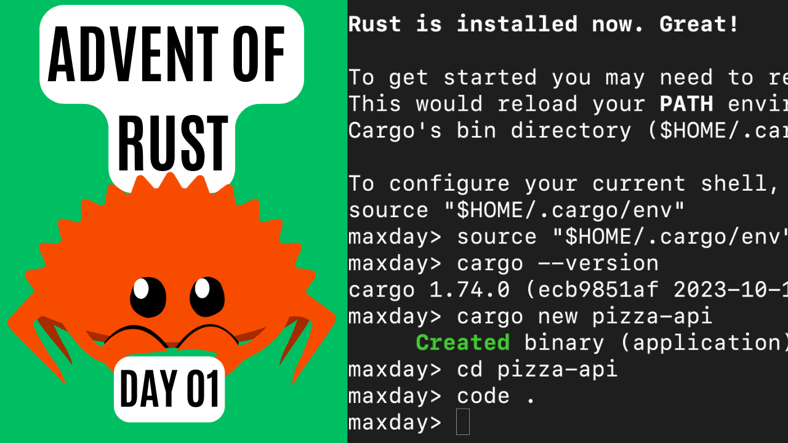
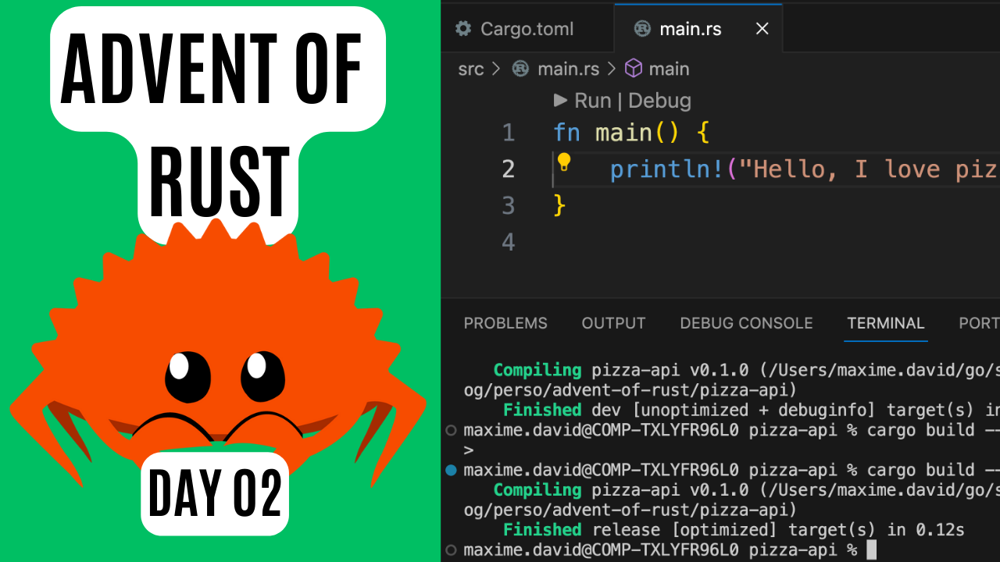
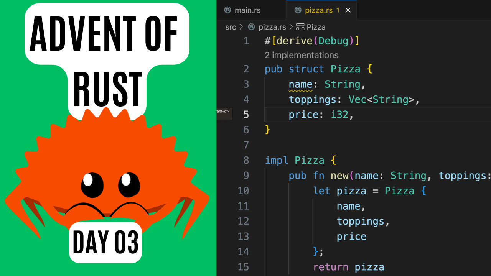
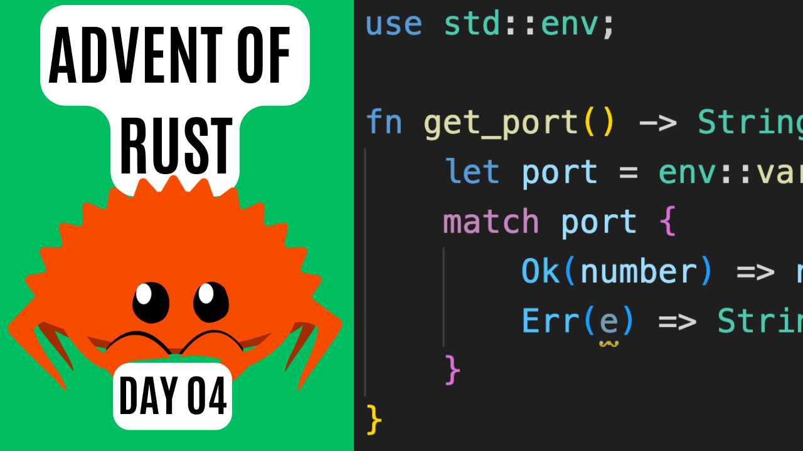
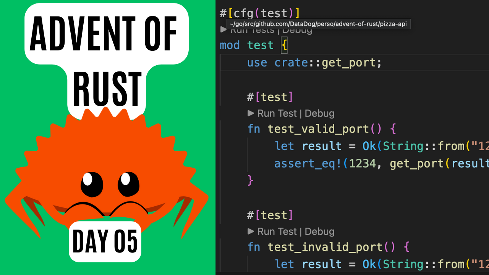
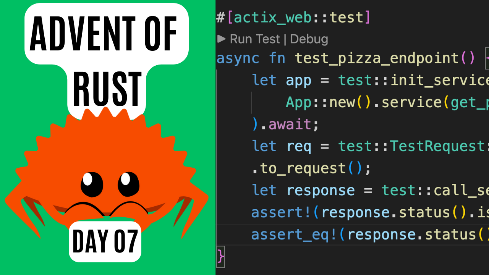

# Advent of Rust

Welcome to this new Rust adventure!
Every day we will build together a Rust REST API.

Very beginner friendly, we will do it with live coding with detailed step by step!

Enjoy! 🦀

| Day #      | Description  | YouTube Link (clickage image) |
| ----------- | ----------- | ----------- |
| 01      | Rust installation and IDE configuration        | 
| 02      | Cargo commands       | 
| 03      | Struct and functions  | 
| 04      | Result type  | 
| 05      | Unit testing  | 
| 06      | Crates  | 
| 07      | Unit testing endpoint  | 
| 08      | Build a Docker image  | 
| 09      | Authentication Part 1  | 

*⚠️ This project is not associated, affiliated, endorsed, or sponsored by the Rust foundation.*

